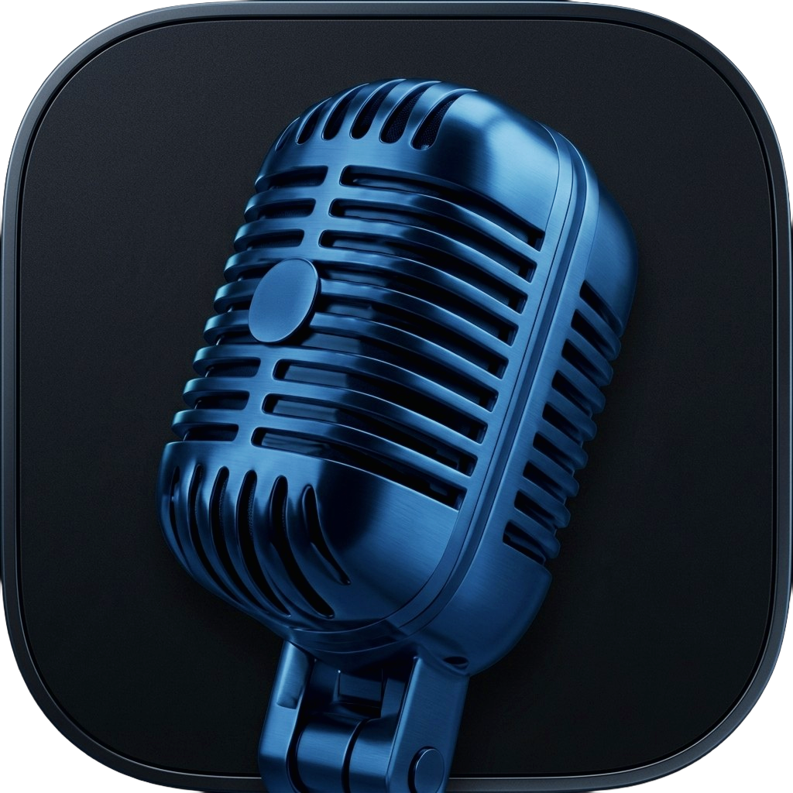

<div align="center">



# WinWhisper Flow

**Local, private speech-to-text for Windows 11.**
Dictate anywhere on your PC — no internet connection, no cloud API, no data leaving your machine.

[](https://dotnet.microsoft.com/)
[](https://www.python.org/)
[](#requirements)
[](LICENSE)
[](https://github.com/mustakim-init/WinWhisperFlow/releases)
[](https://github.com/mustakim-init/WinWhisperFlow/issues)

[Download](#download) · [Documentation](docs/README.md) · [Features](#features) · [Contributing](CONTRIBUTING.md) · [Report a Bug](https://github.com/mustakim-init/WinWhisperFlow/issues/new)

</div>

---

> **⚠️ Early-stage project.** WinWhisper Flow is under active development. Core dictation is stable and used daily by the maintainer, but you may hit rough edges — especially around GPU setup and packaging. Bug reports and PRs are very welcome.

## What is WinWhisper Flow?

WinWhisper Flow is a **local alternative to cloud dictation tools** like Wispr Flow, Windows Voice Access, or browser-based speech APIs. Press a hotkey, speak, and your words are typed into whatever app you're focused on — all powered by [`faster-whisper`](https://github.com/SYSTRAN/faster-whisper) / [`sherpa-onnx`](https://github.com/k2-fsa/sherpa-onnx) running entirely on your own hardware.

No audio, transcript, or telemetry is ever sent off your device.

## Features

| | |
|---|---|
| 🔒 **100% offline** | Speech recognition runs locally via `faster-whisper` (CPU) or `sherpa-onnx` (GPU). No account, no API key, no network calls at inference time. |
| 🎙️ **Live dictation** | Press a global hotkey anywhere in Windows and speak — text is transcribed and auto-pasted into the focused app in real time. |
| 📁 **File transcription** | Drop in audio or video files and get a full transcript with progress tracking and cancel support. |
| 🎵 **Music / vocal transcription** | Built-in [Demucs](https://github.com/facebookresearch/demucs) source separation isolates vocals before transcribing songs. |
| 📱 **Phone mic** | Turn your phone into a wireless microphone over your local network — scan a QR code, no app install required. |
| ⚡ **GPU acceleration** | Auto-detects NVIDIA CUDA or DirectML-compatible GPUs and falls back to CPU automatically. |
| 🧠 **Multiple model sizes** | Choose from `tiny` to `large-v3`/`turbo` Whisper models depending on your speed/accuracy needs. |
| ✍️ **Editable transcripts & history** | Every dictation is saved to a searchable history; fix mistakes inline and copy with one click. |
| 🎨 **Dark mode** | Native dark theme built into the WebView2 UI. |
| 🚀 **Guided first-run setup** | The app checks your hardware and installs the correct Python runtime and models automatically. |

## How it works

```
┌───────────────────────────────────────────┐
│            WPF Host (WebView2)             │
│   React 19 + TypeScript + Tailwind UI      │
│   Dictation · File Transcription · Phone   │
│   Mic · Models · Settings · History        │
└───────────────────┬─────────────────────────┘
                     │ IPC (chrome.webview messages)
┌───────────────────┴─────────────────────────┐
│              C# Backend (.NET 8)            │
│   NAudio (capture) · Global hotkey hook     │
│   PhoneMicService (local HTTPS + QR)        │
│   WhisperBridgeService (model lifecycle)    │
└───────────────────┬─────────────────────────┘
                     │ local process I/O
┌───────────────────┴─────────────────────────┐
│         Python STT Sidecar (isolated)       │
│   CPU  → faster-whisper (CTranslate2)       │
│   GPU  → sherpa-onnx (CUDA / DirectML)      │
│   Demucs → vocal / music source separation  │
└───────────────────────────────────────────────┘
```

See [docs/architecture.md](docs/README.md#for-developers) for the full breakdown of each component.

### Stack

| Layer | Technology |
|---|---|
| Desktop shell | .NET 8 WPF + WebView2 |
| Frontend | React 19, TypeScript, Tailwind CSS v4, Vite 6, Zustand |
| Audio capture | NAudio (16 kHz mono PCM) |
| Speech-to-text | `faster-whisper` (CPU) · `sherpa-onnx` (GPU, CUDA/DirectML) |
| Source separation | Demucs (PyTorch) |
| Phone mic transport | Local HTTPS server + WebRTC getUserMedia, paired via QR code |
| Packaging | Inno Setup (installer) · PyInstaller (Python sidecar) |

## Download

Grab the latest installer from the **[Releases page](https://github.com/mustakim-init/WinWhisperFlow/releases)**. No Python, .NET, or Node.js installation needed for the packaged build — everything required ships in the installer.

**Requirements to run the packaged app:**

| Requirement | Minimum |
|---|---|
| OS | Windows 11 (build 19041+) — Windows 10 not officially supported |
| RAM | 8 GB (16 GB recommended for `medium`/`large` models) |
| Disk | ~2–6 GB free, depending on models downloaded |
| GPU (optional) | NVIDIA (CUDA) or any DirectX 12 GPU (DirectML) for acceleration |

New here? Start with the **[Getting Started guide](docs/user-guide.md)**.

## Quick Start (from source)

For running or building the app from source instead of using the installer:

```powershell
# 1. Clone the repo
git clone https://github.com/mustakim-init/WinWhisperFlow.git
cd WinWhisperFlow

# 2. Set up the Python runtime and restore .NET packages
.\scripts\setup.ps1

# 3. Build the WebUI
cd WebUI
npm install
npm run build
cd ..

# 4. Run
dotnet run
```

**Prerequisites for building from source:**

| Tool | Version |
|---|---|
| .NET SDK | 8.0 or newer |
| Python | 3.10 or newer |
| Node.js | 18 or newer |
| Windows | 11 (build 19041+) |

Full build, packaging, and installer instructions: **[docs/building-from-source.md](docs/building-from-source.md)**.

## Keyboard shortcut

WinWhisper Flow uses a single configurable global hotkey to start and stop dictation — **`Ctrl + Alt + S`** by default. Change it any time under **Settings → Captures**.

## Documentation

Full documentation — installation, day-to-day usage, phone mic setup, configuration reference, troubleshooting, and privacy details — lives in **[`/docs`](docs/README.md)**:

- 📥 [Installation Guide](docs/installation.md)
- 📖 [User Guide](docs/user-guide.md)
- 📱 [Phone Mic Setup](docs/phone-mic.md)
- ⚙️ [Configuration Reference](docs/configuration.md)
- 🛠️ [Troubleshooting](docs/troubleshooting.md)
- ❓ [FAQ](docs/faq.md)
- 🔒 [Privacy & Security](docs/privacy-and-security.md)
- 🧑‍💻 [Building from Source](docs/building-from-source.md)

## Contributing

Contributions are very welcome — this is a hobby project built from scratch and there's plenty to improve. See [CONTRIBUTING.md](CONTRIBUTING.md) for setup instructions and current focus areas (packaging reliability, GPU support, Demucs, phone-mic stability, localization).

Found a bug or have a feature request? [Open an issue](https://github.com/mustakim-init/WinWhisperFlow/issues/new).

## Changelog

See [CHANGELOG.md](CHANGELOG.md) for release notes.

## License

WinWhisper Flow uses a **dual license**:

- **Non-commercial use** — free, for personal and hobby projects.
- **Commercial use** — requires a paid license.

See [LICENSE](LICENSE) for full terms and pricing tiers. For commercial licensing, contact **mioact2smart@gmail.com**.

## Credits

- [faster-whisper](https://github.com/SYSTRAN/faster-whisper) — CPU speech-to-text engine
- [sherpa-onnx](https://github.com/k2-fsa/sherpa-onnx) — GPU-accelerated inference
- [Demucs](https://github.com/facebookresearch/demucs) — music source separation
- [NAudio](https://github.com/naudio/NAudio) — Windows audio capture
- [WebView2](https://developer.microsoft.com/en-us/microsoft-edge/webview2/) — embedded UI host
- [Voicebox](https://voicebox.moda) — design inspiration

---

<div align="center">
Made by <a href="https://github.com/mustakim-init">Mustakim Ahmed</a> — a hobby project, built in the open.
</div>
